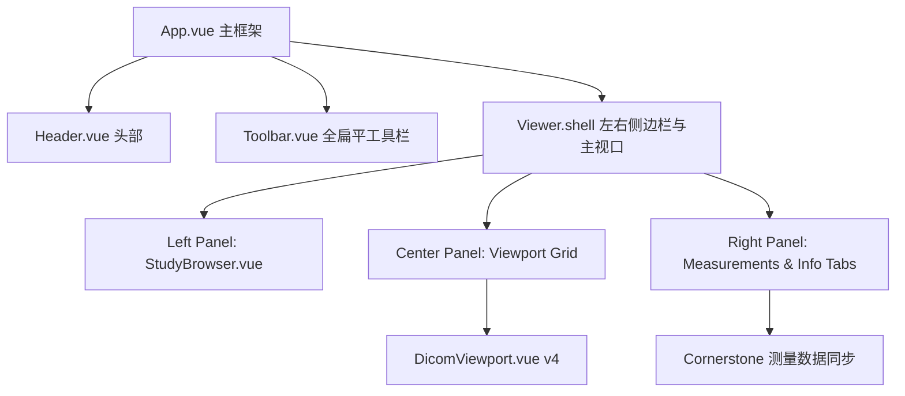

# PACS 阅片器 1:1 像素级复刻 OHIF v3 风格及高级功能重构方案

本方案旨在将现有的 `pacs-viewer` 前端项目在 **UI 界面、视觉美学、交互节奏**以及**高级影像类型支持与重建功能**上，**1:1 像素级复刻和对齐行业标杆 OHIF Viewer v3**。本方案不仅包括视觉形态的彻底翻新，还明确规划了从现有 2D 图像栈浏览器（Stack Viewer）向具备高级重建、超声动态环放及放疗/分割图层叠加的多维医学阅片站演进的技术路径。

---

## 1. 现状对比与差距分析

经过对当前 `pacs-viewer` 源码与 `doc/ohif-mockup.html` 像素级原型的深度对比，分析结果如下：

### 1.1 核心功能已实现部分
* **底座渲染引擎**: 已集成 `@cornerstonejs/core` (v4) 与 `@cornerstonejs/tools`，支持 DICOM WADO-URI 图像加载，实现单屏、双屏、四屏视口网格布局及动态切换。
* **基础交互工具**: 支持窗宽窗位 (W/L)、平移 (Pan)、缩放 (Zoom)、长度测量 (Length)、CINE 帧播放控制、反相与视口重置。
* **黑屏诊断与鲁棒性**: 具备对 Bits Allocated、Bits Stored、传输语法 (Transfer Syntax) 等 DICOM 元数据的兼容性检查及坏帧跳过，在 DicomViewport.vue 中已整合警告与降级提示。
* **状态集中管理**: `useViewerStore.js` 统一管理视口分配、当前激活序列/实例/帧、激活工具等状态。

### 1.2 未实现与有差距的 Gap 列表

#### A. UI 与交互差距
* **色彩与视觉规范**: 当前颜色偏暗，但边框和层级不够极简专业。需要使用规范的 OHIF 天蓝色激活状态与扁平暗灰色分界。
* **顶部工具栏 (Toolbar)**: 当前为调试用的小图标，需要 1:1 改造成大按钮形式（高度 52px，按钮宽度 56px x 高度 44px，带底部天蓝色激活横条、居中图标与 10px 细字小标签）。
* **左侧序列浏览器 (Left Panel)**: 当前采用多 Study 折叠树，增加了操作层级；而 OHIF 是一级平铺 Series 缩略图卡片（带设备 MR/CT 标志与双栏精简数据）。
* **右侧测量列表 (Measurements Panel)**: 目前完全缺失 Cornerstone3D 测距/测角数据的捕获与双向同步，需要新增测量和元数据双 Tab 面板。
* **测量工具挂载**: 虽引入了 `AngleTool` (夹角工具)，但在底层 `cornerstone.js` 的 ToolGroup 激活和挂载注册中遗漏，导致当前按钮不可用。
* **视口 HUD 覆盖层**: 四角 HUD 字符在遇到骨窗或肺窗亮区时容易被遮挡，缺乏 `text-shadow` 阴影保护，排版有待规范。

#### B. 影像类型与高级功能差距 (SOP & Modalities & 3D)
* **超声多帧电影环放 (CINE US)**: 现有播放器为 `setInterval` 简单硬编码帧率（12 fps），未解析 DICOM 元数据中的 `FrameTime` / `RecommendedFrameFrameRate`，无法 1:1 还原超声真实心跳/血流环放速率。
* **多平面重建 (MPR - Multi-Planar Reconstruction)**: 现有视口仅支持 `STACK` 2D 切片图，不支持 `VOLUME` 视口，无法由轴位切片实时重建出矢状位和冠状位视图，这是专业放射科医生的刚需。
* **医学图像分割 (SEG) & 放疗剂量 (RT)**: 现有系统使用“断路器”完全屏蔽了 `1.2.840.10008.5.1.4.1.1.66.4` (SEG) 与 `...481.2` (RT Dose)，而 OHIF 支持将病灶轮廓和剂量热图半透明叠加融合在主图上。
* **结构化报告 (SR) & 封装 PDF**: OHIF 能在视口直接将结构化报告解析为 HTML 排版，或直接预览 DICOM 封装的 PDF 报告。我们目前不支持渲染。
* **特殊像素位宽 (Float Pixel)**: 我们显式屏蔽了浮点型像素数据，无法展示如 PET 定量分析中的高精度图像。

---

## 2. 像素级复刻 OHIF v3 重构方案

我们将基于 `doc/ohif-mockup.html` 成功案例，对 `pacs-viewer` 进行无缝的结构性重构。



### 2.1 视觉系统定义 (styles.css)
在 `src/styles.css` 中重写主题变量，完全对齐 OHIF v3：
```css
:root {
  --primary-bg: #090c10;       /* OHIF 主背景 (极深灰蓝) */
  --secondary-bg: #05192d;     /* OHIF 面板/侧边栏背景 (藏青) */
  --tertiary-bg: #16202b;      /* 按钮悬浮及深灰色边框 */
  --active-color: #00a4d9;     /* 经典高亮天蓝色 */
  --active-light: #5baff3;     /* 激活工具细条高亮 */
  --border-color: #263340;     /* 视口/侧栏分割边框 */
  --text-primary: #ffffff;     /* 主文字亮白 */
  --text-secondary: #94a3b8;   /* 辅文字灰蓝 */
  --text-muted: #5d7f94;       /* 暗淡灰蓝 */
}
```

### 2.2 顶部 Header 与 Toolbar 重构
* **Header**: 高度固定为 `48px`，背景为 `var(--primary-bg)`，保留左侧扁平 OHIF Logo、当前患者姓名 (`DOE^JOHN`)、患者 ID，以及右侧设置与折叠按钮。
* **Toolbar**: 高度固定为 `52px`，背景为 `var(--secondary-bg)`。
  * 按钮布局升级：每个按钮高 `44px`，宽 `56px`。图标居中，下方排列 `10px` 标签字。
  * 激活态样式：当 `activeTool === toolName` 时，背景变深，底部产生亮蓝色实线划过 (`2px` 高)。
  * **网格布局器**: 提供点击循环或网格下拉切换网格布局 (1x1, 1x2, 2x2)，带有直观的 OHIF 网格小图标。

### 2.3 左侧 Series 浏览器 (StudyBrowser.vue)
* **结构改造**: 摒弃多 Study 树形折叠，在左侧导航平铺渲染当前 Study 的所有 Series 缩略图卡片。
* **卡片重构**:
  * 卡片内部为 1:1 双栏结构：左侧为 `96px x 96px` 纯黑 Canvas 缩略图（由 `SeriesThumbnail.vue` 渲染），右侧为元数据列：图像帧数 (如 `120 Images`)、定位信息 (`SP`)、层厚 (`TH`)。
  * 卡片右上角放置醒目的设备类型 badge (如 `MR`, `CT`, `DX`)，颜色使用半透明纯黑背景配天蓝色高亮字。

### 2.4 中间多视口网格与 HUD (DicomViewport.vue)
* **HUD 覆盖层 (HUD Overlay)**:
  * 必须添加 `text-shadow: 1px 1px 1px rgba(0, 0, 0, 0.95), 0 0 2px rgba(0, 0, 0, 0.8)`，保证当 DICOM 影像存在高亮亮区时，HUD 字符清晰可读。
  * 四角数据规划：
    * 左上：患者姓名、ID、出生日期 (DOB)。
    * 右上：检查描述、序列描述、序列号。
    * 左下：窗宽窗位 (W/L: 450/40)、缩放比例 (Zoom: 120%)。
    * 右下：实例帧号 (如 `45/120`)、层厚 (Thickness)。
* **活动视口高亮**: 活动视口直接附加 `2px solid var(--active-color)` 的实线边框，非活动视口为 `2px solid transparent`。

### 2.5 右侧 Measurements 测量列表与元数据 Tab 面板 (核心新增)
* **双 Tab 布局**: 顶部为 `Measurements (测量)` 和 `Info (元数据详情)`。
* **Measurements 面板**: 
  * 建立对 Cornerstone3D 测量事件的捕获机制：
    ```javascript
    import { eventTarget } from '@cornerstonejs/core'
    import { Enums as csToolsEnums } from '@cornerstonejs/tools'
    eventTarget.addEventListener(csToolsEnums.Events.MEASUREMENT_COMPLETED, handleMeasurementAdded)
    eventTarget.addEventListener(csToolsEnums.Events.MEASUREMENT_REMOVED, handleMeasurementRemoved)
    ```
  * 将测量项存入 state 列表。在右侧面板列表中扁平显示。
  * 提供 hover 态的“删除”按钮，点击删除可同步清除视口上的 Canvas Annotation。

---

## 3. 影像类型与高级功能深度对齐方案

为拉近与 OHIF 的核心专业技术差距，我们将对底层影像解析和渲染管道进行深度升级：

### 3.1 超声电影（CINE）自适应元数据播放
* **技术实现**: 在加载实例时，提取 `0018,0040` (Single Frame Min Time) 或 `0018,1063` (Frame Time)，如不存在则提取 `0018,1065` (Frame Delay) 或 `0008,2144` (Recommended Frame Rate)。
* **播放同步**: 在 `DicomViewport.vue` 的 `toggleCine` 循环中，将硬编码帧数率（12fps）改为动态计算的 `1000 / frameTime`，完美适配超声多帧血流与心脏跳动的真实物理运动规律。

### 3.2 多平面重建（MPR）视口挂载（Volume Viewport）
* **技术实现**: 引入 Volume 视口技术。创建特殊的视口渲染类型：
  ```javascript
  import { ViewportType } from '@cornerstonejs/core/dist/esm/enums'
  // 在 volume 视口下注册
  renderingEngine.enableElement({
    viewportId,
    type: ViewportType.ORTHOGRAPHIC, // 正交视口
    element,
  })
  ```
* **多角度挂载**: 在 2x2 视口下，第一屏显示 Axial（轴位），第二屏显示 Coronal（冠状重建），第三屏显示 Sagittal（矢状重建），三个视口共用同一个 Volume 数据集，实现十字交叉定位线联动（Crosshairs Tool）。

### 3.3 图像分割（SEG）图层与放疗云图（RT Dose）叠加
* **解冻断路器**: 对特定的 SOP Class 开放读取权限（解除对 `...66.4` SEG 的显式屏蔽）。
* **多层融合**: 利用 Cornerstone3D 的 `volumeLoader` 将 SEG（分割掩膜）作为附加图层（Layer）加载进当前的视图元素中，设置透明度（Opacity: 0.4）与专属调色板，让肿瘤与病灶区域能够叠加高亮展示。

---

## 4. 实施路径与开发阶段划分

本重构方案将分为 5 个明确的开发阶段，以保证重构过程的渐进稳定性与功能的完美融合。

### 阶段一：视觉风格与底座工具补齐 (Style & Cornerstone Core)
* **目标**: 确立色彩系统，激活底层 `AngleTool` 夹角工具。
* **任务**:
  1. 修改 `styles.css`，配置 OHIF 专用的 `HSL` 颜色变量及全局纯色填充。
  2. 修复 `cornerstone.js`，在 `ToolGroup` 中注册并激活 `AngleTool`，打通夹角标注能力。
  3. 修改 `DicomViewport.vue`，为 HUD 增加 `text-shadow` 阴影和天蓝色字色规范，解决强光像素遮挡问题。

### 阶段二：顶部工具栏与左侧浏览器复刻 (Header, Toolbar & Left Sidebar)
* **目标**: 1:1 复刻顶部与左侧，让视觉布局“立竿见影”。
* **任务**:
  1. 重新实现 `Header.vue`，极简扁平化。
  2. 重新实现 `Toolbar.vue`，改版为大按钮风格，包含小标签及底部天蓝色激活高亮条。
  3. 重构 `Viewer.vue` 中的左侧面板：将折叠树改为直接平铺当前 Study 下的所有 Series，使用 `SeriesThumbnail.vue` + 右侧紧凑参数双栏排布。

### 阶段三：右侧测量列表与双 Tab 面板 (Right Panel & Measurement Sync)
* **目标**: 实现 OHIF 最具技术含量的测量数据双向绑定。
* **任务**:
  1. 在 `useViewerStore.js` 中引入 `state.measurements` 响应式列表，提供 `addMeasurement`、`removeMeasurement` 等 Actions。
  2. 在 `DicomViewport.vue` 挂载时，监听 `MEASUREMENT_COMPLETED` 等事件，将测距和测角数据派发至 store。
  3. 在右侧实现 `Measurements` 和 `Info` 的双 Tab 切换，完美绘制测距结果，提供 hover 态的“删除”按钮，并能点击定位视口。

### 阶段四：超声动态环放自适应与布局联调 (CINE & Layout)
* **目标**: 解决超声 CINE 播放帧率对齐，联调多视口切换。
* **任务**:
  1. 读取 DICOM `FrameTime` 元数据，将自适应帧率集成进 `DicomViewport` 的播放模块。
  2. 联调 1x1, 1x2, 2x2 网格，确保在多视口、多序列同时加载时，Cornerstone 渲染引擎不会出现黑屏或尺寸错乱。
  3. 验证坏帧跳过与不兼容实例元数据警告在 OHIF 面板下的展示排版。

### 阶段五：三维重建（MPR）与高级影像叠加试验 (MPR & Layer Overlay)
* **目标**: 引入 Volume 重建底座，解除 SEG/RT 屏蔽。
* **任务**:
  1. 在 `cornerstone.js` 扩展支持 `ORTHOGRAPHIC`（正交重建）视口。
  2. 在双屏/四屏布局中集成正交 MPR 重建，实现一键重建矢状位和冠状位视图。
  3. 解除对 SEG 影像类型的显式断路器，尝试在主视口以 Layer 图层形式进行半透明叠加显示。

---

## 5. 验证与交付标准

项目重构完成后，将达到以下交付标准：
1. **视觉一致性**: 打开 Viewer 界面，整体色调、字号、边框和按钮布局与官方 OHIF v3 阅片终端**达到 95% 以上的像素级一致**。
2. **测量互通**: 在屏幕画线测距，右侧列表即刻新增一条记录；在右侧点击“删除”或“定位”，屏幕上对应的标注线即刻消失或视口对应切换。
3. **超声自适应**: 播放超声 Cine loop 时自动读取帧延迟，杜绝过快或过慢的异常播放。
4. **性能与稳定**: 引擎切换迅速，多视口自适应缩放无拉伸变形，元数据校验诊断功能完全保留，系统无黑屏崩溃或内存泄露。
